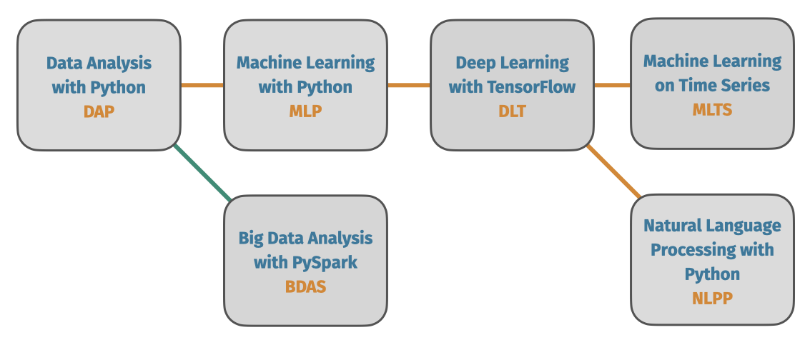

<div align="center">
  <h1>Data Science Learning Paths</h1>

  <p><b>Basic and advanced data science courses</b></p>
</div>





## Credits

Course material developed by the team [@point8](https://github.com/point8) and [@clstaudt](https://github.com/clstaudt).

## License

Copyright © 2018-2022 [Point 8 GmbH](https://point-8.de)

The training material in this repository is licensed under a Creative Commons BY-NC-SA 4.0 license. See [LICENSE](LICENSE) file for more information.


## Contributing

* Contributions welcome! Have a look at [CONTRIBUTING.md](CONTRIBUTING.md)


## Development

We use [`pyenv`](https://github.com/pyenv/pyenv) and [`poetry`](https://github.com/python-poetry/poetry) to setup the python development environment.

After installing those two, run the following lines to be ready to develop:

```
pyenv install -s "$(cat .python-version)"
poetry env use "$(cat .python-version)"
poetry install
```

Now you can start your `jupyter-lab` UI with

```
poetry run jupyter-lab
```

or a classic `notebook` view with

```
poetry run jupyter notebook
```

### Working with on Apple Silicon M1 hardware

As there might occur some problems using the preferred setup on M1 hardware, you could also use [`conda`](https://github.com/conda-forge/miniforge).

As the leading system is poetry, please update the requirements file according to the dependencies in the `pyproject.toml`.
